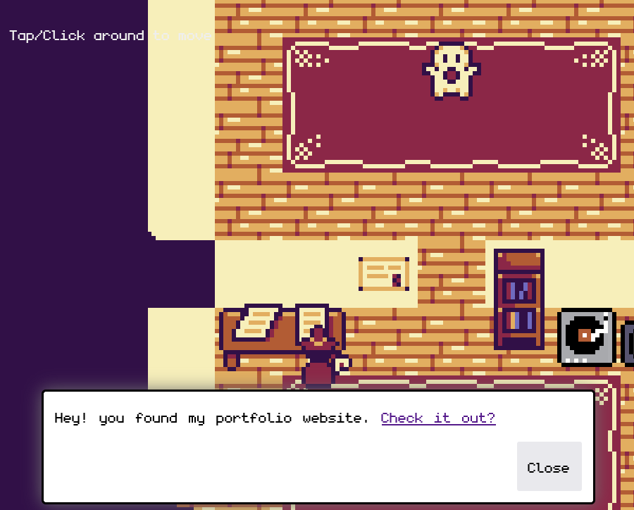

# RPG Portfolio

Inspired by JSLegendDev video, I created my own RPG like 2D Portfolio.

Live Demo : https://atilio-ts.github.io/rpg-2d-portfolio/

I used a modified version of this original tileset (Giving credit where it's due) : https://momen-games.itch.io/happy-la-v2-ts

# How to run

Note: You need `Node.js` and `npm` installed on your machine.

`npm install` then `npm run dev`

# How to build

`npm run build` and a dist folder should be created.

# How to preview the build

`npm run preview`
